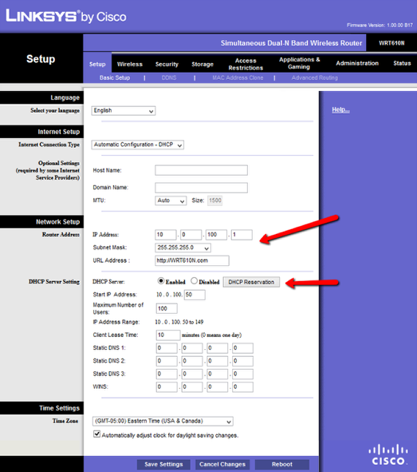
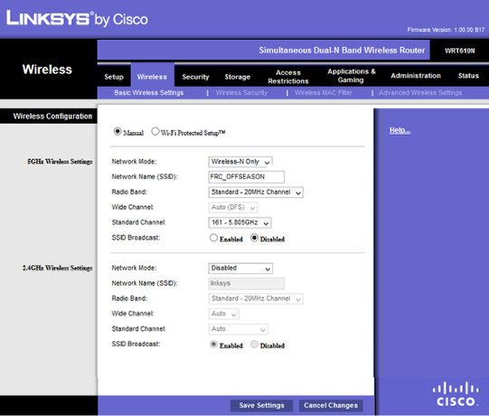
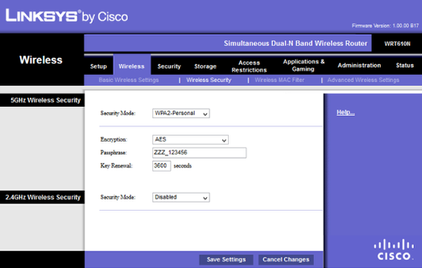

.. include:: <isonum.txt>

Router Configuration
====================

Router Notes
------------

Your router will need to be configured in order to correctly communicate with robots that come to the field. Many different kinds of routers can be used, but a Linksys WRT610N or equivalent is recommended. The instructions in this documentation apply to many kinds of routers (WRT shown), but may be slightly different depending on the hardware you use.

* Open the router’s web configuration, which is usually at an IP such as 192.168.1.1. You will also need to log in to the router administrative pages.

IP Address
----------

As shown in the diagram, set the IP address to 10.0.100.1 and the Subnet Mask to 255.255.255.0. Make sure you Enable the DHCP server with a Start IP Address of 50, Maximum Number of Users of 100, and Client Lease Time of 10 minutes. Save the settings, and the router will apply them. After about a minute, unplug the Ethernet from your computer and re-attach it to acquire a new IP address. In your browser, navigate and login to the router again (which is now at 10.0.100.1).

Wireless Configuration
----------------------

* Navigate to the Basic Wireless Settings for the router.

In Manual configuration, for 5GHz settings, select Network Mode of Wireless-N Only, Network Name of [ *your event ssid* ], Radio Band of Standard - 20MHz Channel, Standard Channel of [ *your event channel* ], and SSID Broadcast as Disabled.

For 2.4GHZ select setting for Network Mode of Disabled. Save the settings.

Security
--------

* Navigate to the Wireless Security for the router.

For 5GHz select settings for Security Mode of WPA2-Personal, Encryption of AES, Passphrase of [ *your event passphrase* ], and Key Renewal of 3600.

For 2.4 GHz select settings for Security Mode of Disabled.

Save all your settings.

Note
----

You can adjust the settings as you see fit, but be sure to keep the teams and FTA at your event in the loop to assist with troubleshooting any problems you may run into. Example images and steps may not fit exactly with your router, but similar options should be available.
