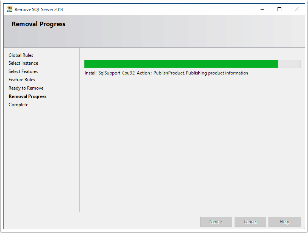
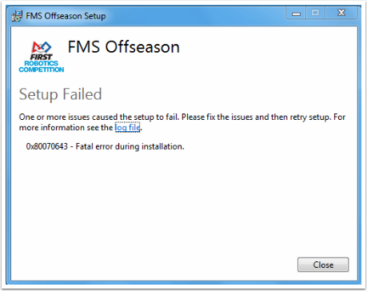

.. include:: <isonum.txt>
.. _off-season-upgrading:

Upgrading from a previous edition of FMS Off-Season
=======================================================

In order to install an edition of Off-Season FMS on a machine that had a previous installation of FMS (any previous year to your target install), some changes must be made prior to running the installer.

If the target machine does not contain a previous version of FMS, Off-Season this article is not relevant.

.. note::
    Running this process will delete all the match/scoring data from this machine. Proceed with caution.

Uninstall the previous FMS Edition
----------------------------------

Using the machine's Control Panel, look for the previous edition of "FMS Off-Season" and select Uninstall. Upon successful uninstall, the screen at right will be shown.

Remove SQL Server 2014 (or 2016)
--------------------------------

On your computer's Control Panel, navigate to Uninstall/Manage Programs, and find "Microsoft SQL Server 2014" in the list. Select "Uninstall/Change" and then "Remove" from the menu that appears. Depending on your machine, you may instead have Microsoft SQL Server 2016, but the same uninstall process should be followed.

An instance selection panel will appear. Make sure "FRCSQLEXPRESS" is selected, then select "Next."

The Features menu will appear. Click the "Select All" button, then "Next."

The confirmation screen will appear. Select "Remove" to begin the process.

Windows will configure the changes to remove the old FMS database installation.

When the changes are complete, you can click "Close."

The FMS Off-Season installer will add the new version of the database to your machine as part of it's standard installation process. There is no need to manually adjust other SQL settings prior to running the installer.

Reboot
------

Reboot the computer before continuing.

Installing FMS Off-Season
-------------------------

For information on installing the new version of FMS, please :doc:`go to this article <installation>`.

Failed Installations
--------------------

If your machine is not compatible, or the installer encounters other problems, you can review the log file for assistance. *FIRST* HQ is not able to provide individual troubleshooting assistance.
