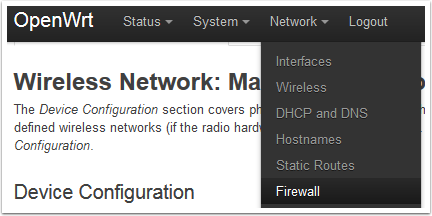
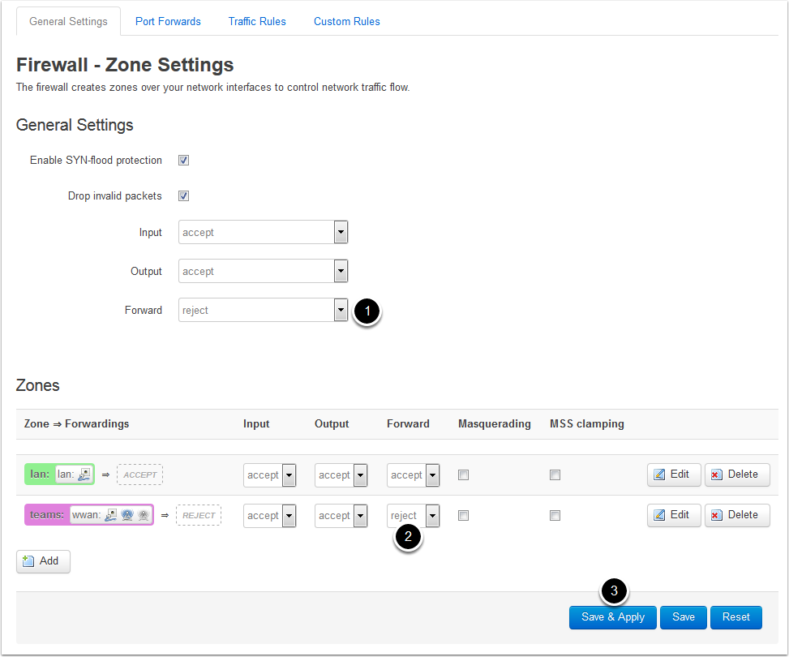
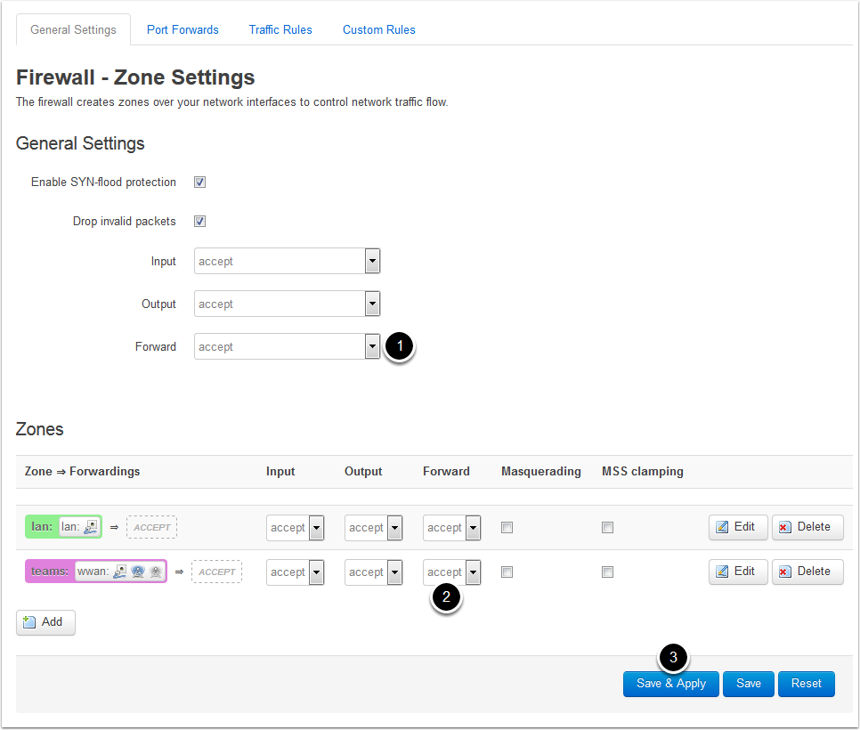

Firewall Settings
=================

As detailed in the :doc:`Default Settings <default-settings>` article, the image comes with the firewall enabled by default. This article describes how to disable and re-enable the firewall. This article does not go into detail on how to add additional rules to the firewall, if you wish to do this, we recommend editing the /etc/firewall file directly (either via ssh or copying it off the device and then back on) and using the existing rules as a template.

Accessing the Firewall Page
---------------------------

#. Using a web-browser, enter in the appropriate address based on how you are connected to the AP (192.681.1.1 for the "Internet" port, 10.0.100.2 otherwise). If the web page does not come up, make sure the AP is powered on (both plugged in and power switch turned on), and that your computer is set to an approriate IP (192.168.1.* for the Internet port, DHCP otherwise).
#. Log in using the default username/password of root/root
#. From the AP home page, hover over the Network menu and select the Firewall entry to navigate to the Firewall page.

Disabling the Firewall
----------------------

To disable the firewall:

#. Set the default Forward rule to accept
#. Set the Forward rule for the teams zone to accept
#. Click Save & Apply

Re-enabling the Firewall
------------------------

To re-enable the firewall

#. Set the default Forward rule to reject
#. Set the teams zone forward rule to reject
#. Click Save & Apply

Warning: Setting other entries to reject may prevent you from accessing the AP web page and/or SSH. If this happens, you may be able to access the web page via the alternate address (192.168.1.1 ont he Internet port vs 10.0.100.2 on the other ports.) If you are still unable to access the AP, you may need to perform the recovery procedure described in the :doc:`Recovery Procedure <recovery-procedure>` article.
