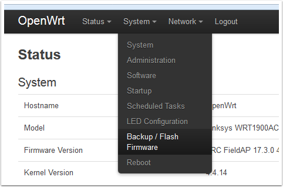
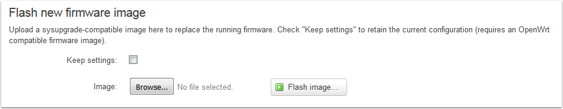

.. include:: <isonum.txt>

Loading OpenWRT
===============

This article describes how to load the customized FRC\ |reg| build of OpenWRT onto a Linksys 1900ACS wireless access point. This customized build contains versions of various components that have been tested to be (mostly) stable in the FRC use case. It also contains a default network setup (network and wireless configuration, firewall, DHCP, etc.) appropriate for many FRC use cases.

Aquiring the firmware
---------------------

Go to one of the following locations to download a ZIP of the FRC firmware build.

`Offseason Simple <https://usfirst.collab.net/sf/frs/do/viewRelease/projects.offseasonfms/frs.2017_fms_offseason.may_2017>`_

`Offseason VLAN <https://usfirst.collab.net/sf/frs/do/viewRelease/projects.offseasonfms/frs.2017_fms_offseason.2017_linksys_ap_image_with_vlan>`_

The filename of the image files will always be constructed using the following pattern:

frc-DESCRIPTOR-YEAR.MAJOR.MINOR-mvebu-armada-385-linksys-shelby-squashfs-IMAGETYPE

DESCRIPTOR is a description of the specific type of FRC image. "offseason_simple" is typically going to be the image you are looking for, this image removes all of the VLAN configuration from the network configuration and reverses the ports from the standard FRC image to allow the 4 ports on the AP to be used as a switch in offseason configurations. "offseason_vlan" is identical to the standard FRC image but with the username/password set to root/root and can only be effectively used with network hardware that is sending appropriately tagged packets over a VLAN trunk line plugged into the AP's yellow port.

YEAR is the year of the firmware build

MAJOR is the major release number

MINOR is the minor release number. This is used for internal builds and should always be 0 on release builds

IMAGETYPE is the type of OpenWRT image. "factory.img" is the image that is used to switch to OpenWRT from the factory Linksys firmware. "sysupgrade.tar" is the image used to update an existing OpenWRT installation.

From Stock Firmware
-------------------

The following section describes how to load the FRC OpenWRT image onto the device from the stock Linksys firmware.

Connecting to the AP (Default Linksys Image)
^^^^^^^^^^^^^^^^^^^^^^^^^^^^^^^^^^^^^^^^^^^^

The most reliable way to connect to the AP is to set your computer to a static IP on the 192.168.1.* subnet. The AP is reachable at 192.168.1.1 so it is recommended to set your computer to 192.168.1.2 with a netmask of 255.255.255.0. Plug your PC into one of the 4 ports labeled "Ethernet" on the back of the AP.

Open a webbrowser and enter 192.168.1.1 into the address bar. The browser will automatically re-direct you to the Linksys setup page.

Check the top box to indicate that you accept the License, then click the Manual Configuration link the bottom left of the page.

Login
^^^^^

#. Wait for the internet connection attempt to time out, then click Login (screen not pictured).
#. Enter the default password "admin" and click Sign In.

Access flash page
^^^^^^^^^^^^^^^^^

Click on "Connectivity" in the navigation bar on the left side to access the firmware flash page.

Flash Firmware
^^^^^^^^^^^^^^

#. In the Manual section, click Choose File and browse to the downloaded firmware image, the correct image should end in "factory.img".
#. Click Start
#. In the dialog that pops up, click Yes.
#. In the next dialog that pops up, click Yes.
#. A progress bar will appear indicating firmware update progress. After it completes, click Ok.

To reconnect to the radio at the 192.168.1.1 address, you will need to move the Ethernet cable to the yellow "Internet" port on the AP. Alternately, you can change your computer back to DHCP to connect to the radio at 10.0.100.2

OpenWRT upgrade
---------------

The following section describes how to load the FRC OpenWRT image onto the device when OpenWRT has already been installed (including updating from previous FRC image).

Connecting to the AP (OpenWRT)
^^^^^^^^^^^^^^^^^^^^^^^^^^^^^^

.. image:: images/loading-openwrt-4.png

For both a stock OpenWRT image and an FRC image, the most reliable way to connect to the AP is to set your computer to a static IP on the 192.168.1.* subnet. The AP is reachable at 192.168.1.1 so it is recommended to set your computer to 192.168.1.2 with a netmask of 255.255.255.0. If you are connecting to stock OpenWRT, plug your PC into one of the 4 ports labeled "Ethernet" on the back of the AP; if you are connecting to an FRC image, use the yellow port labeled "Internet".

Open a webbrowser and enter 192.168.1.1 into the address bar. The browser will automatically re-direct you to the LuCI login page.

Username: root

Password: "root" (for an FRC image) or blank for default OpenWRT

Then click Login.

Flash firmware
^^^^^^^^^^^^^^

From the System menu, select Backup / Flash Firmware

#. Locate the Flash new firmware image section of the page
#. Uncheck the Keep settings box. This will erase any changes you have made to settings such as wireless network configuration, firewall, etc. but is required to get any updates to the FRC default settings.
#. Click Browse...
#. Locate the image file. The correct image will end in "sysupgrade.tar".
#. Click Flash image... and wait for the process to complete. If you are upgrading from a stock OpenWRT image, the page may never reconnect after the firmware flash. Wait about 5 minutes to be sure the process is complete, then change your connection to the yellow "Internet" port to reconnect on the 192.168.1.1 address or change your PC to DHCP to connect on the 10.0.100.2 address.
