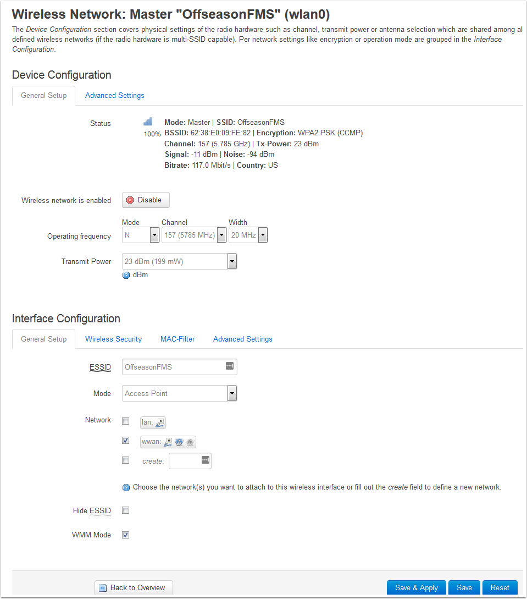
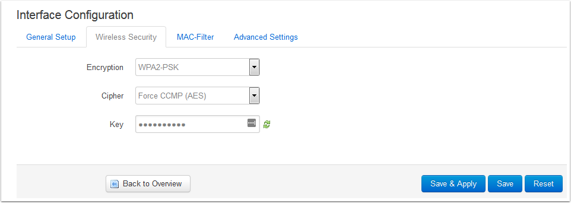

.. include:: <isonum.txt>
.. _off-season-wireless:

Wireless Settings + Status
=================================

This article details how to view the wireless status and change the wireless settings for the FRC OpenWRT image

Accessing the Wireless Overview
-------------------------------

#. Using a web-browser, enter in the appropriate address based on how you are connected to the AP (192.681.1.1 for the "Internet" port, 10.0.100.2 otherwise). If the web page does not come up, make sure the AP is powered on (both plugged in and power switch turned on), and that your computer is set to an approriate IP (192.168.1.* for the Internet port, DHCP otherwise).
#. Log in using the default username/password of root/root
#. From the AP home page, hover over the Network menu and select the Wireless entry to navigate to the Wireless Overview page.

Wireless Overview Page
----------------------

The Wireless Overview page contains information about the status of the wireless adapters and networks of the AP as well as a few buttons to change settings:

#. 802.11nac radio: This section contains information on the status of the 5GHz adapter (channel and current bit rate)
#. Wireless Network: This section contains information on a specific wireless network on the adapter it is listed under. This information includes the SSID (network name) and encryption type
#. Disable/Enable: This button disables the particular network selected. If the network is currently disabled, this will change to an Enable button.
#. Edit: This button brings you to the Wireless Network page for the particular network where you can edit settings such as channel, SSID, security, etc.
#. 802.11bgn radio: This section contains all of the same details as 1-4 above, but for the 2.4GHz adapter
#. Associated Stations: This section provides details on any clients currently connected to the AP wirelessly such as what SSID they are linked to, the client MAC address, the client IP address, the signal-to-noise ratio on frames recieved from the client and the RX rate (the bitrate the client is sending data at) and TX rate (the rate the AP is sending data to the client) of the client.

Wireless Network Page
---------------------

The Wireless Network page contains settings for the Wireless Adapter (top section) and specific wireless network (bottom section). Note that the Offseason image has 1 network per adapter by default.

* Operating Freqency: Contains the Channel and Channel Width settings for the wireless adapter. The image comes with this set to "auto" by default, but you may wish to do a channel scan (there are free applications available to do this on iOS, Android, PC, etc.) and choose the least congested channel. If you have at least 40MHz (2 channels) of clear space, you may wish to use this setting to minmize the chance of bandwidth issues. Note: This AP image and the OpenMesh radio have only been tested using the Band 1 (36-48) and Band 3 (149-165) channels. Use of the Band 2 DFS channels is not recommended.
* Transmit Power: This setting is actually controlled by the legal limits embedded in the radio firmware and the setting on the web page has no effect.

Interface Configuration

* Wireless Security Tab: Clicking this tab will bring you to the Wireless Security settings (detailed below). Click General Setup to return to the pictured screen.
* ESSID: The SSID (network name) of the wireless network
* Mode: The mode the network is operating in. Should not be changed off of Access Point.
* Network: The OpenWRT "network" the Wireless Network is associated with. Should not be changed off of wwan
* Hide ESSID: Hides the SSID in the beacon frames. This means that this network will not show up or will be listed as "unknown" in the network listings of PCs, phones, etc. The OpenMesh radios are capable of connecting to the network even if the ESSID is hidden.
* WMM mode: Controls whether WMM is enabled or not. Leave this checked.

Note: After changing any settings on this page, you must click Save & Apply in order for the settings to be saved and loaded into the radio.

Wireless Security
-----------------

The Wireless Security tab contains the settings for the security of the wireless network. To return to the general settings, click General Setup.

* Encryption: Controls the encryption scheme used for wireless security. It is recommeneded to set this to either Disabled (for no security) or WPA2-PSK (for enabling security)
* Cipher: Controls the cipher used with the selected security. Recommended to leave as Force CCMP (AES)
* Key: The encryption key used for the wireless security. Defaults to being displayed in dot-mode, click the green arrows to toggle to regular character display. TO change the key, enter the new key here and click Save & Apply below.

Note: After changing any settings on this page, you must click Save & Apply in order for the settings to be saved and loaded into the radio.
