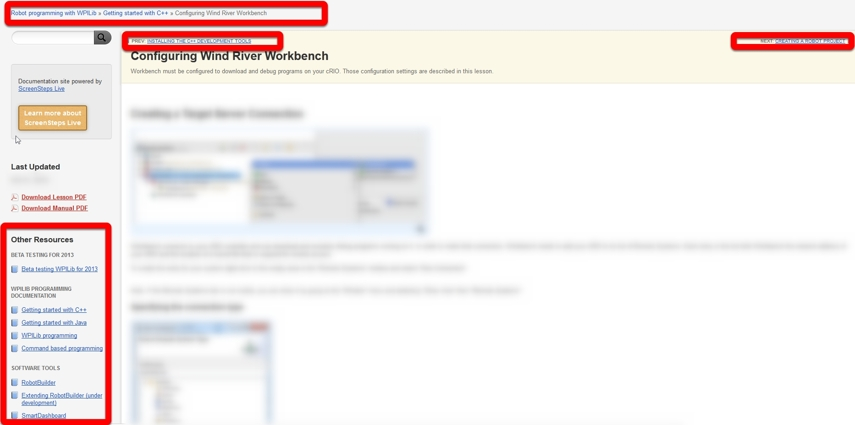
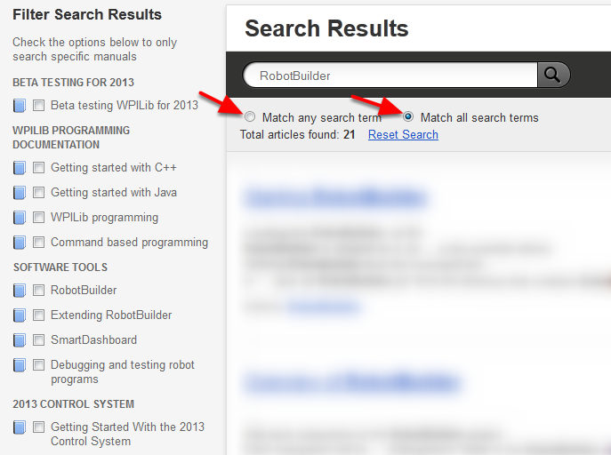
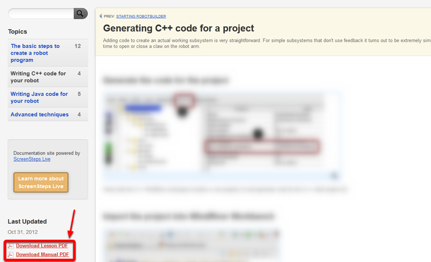

Getting Started With the Screen Steps Documentation
===================================================

ScreenStepsLive is a new tool that FRC/WPI are using to create and present documentation. This document is a brief introduction to the ScreenStepsLive site and the documentation contained here.

What's Here?
------------

The documentation on the ScreenStepsLive site encompasses a number of reference materials for teams, such as robot wiring and programming best practices. This section of the site, however, focused more specifically on the Field Management System (FMS) operation and notes for volunteers who interface with the software from event to event. The examples below were taken from a different project, and show Robot programming sections of WPILib, these example articles do not themselves appear in this portion of the site.

Navigating the Site
-------------------

The documentation is organized into a hierarchy with Sections at the very top, followed by Manuals, Chapters, then Lessons. At any time while you are browsing through the documentation, you can use the navigation at the top of the screen to go back to the Manual or to the home screen. You can also use the navigation on the left side of the screen when viewing a Manual or Chapter to jump to a different Manual. Each article also has a Prev and Next link at the top and bottom of the article to take you to the previous article or next article in the Manual.

Using the Search
----------------

A search bar is located at the top of each page which you can use to search the site. After entering a search query you will be brought to the search results page. From this page you can refine your query by selecting whether to "match any" or "match all" terms in the search. You can also narrow your search to specific manuals by checking them in the left pane.

Downloading PDFs
----------------

For offline viewing, every Manual in the documentation can be downloaded as a PDF. From the manual page or from any of the Lessons within the manual you can download the manual PDF by clicking the link on the left side of the window. Additionally, some individual Lesson PDFs can be downloaded from the lesson pages.

