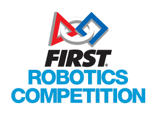
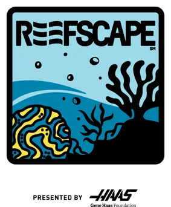

.. _overview-about:

About FMS Documentation and Notes
============================================

Introduction
############

The Field Management System (FMS) is the electronics core of a *FIRST* Robotics Competition (FRC) playing field and encompasses both hardware and software components. The software 
package is used to control all the field electronics (LED Displays, Station Control Cabinets, E-stops, enable/disable of the Robots, network security, etc.) and is used to manage 
the event by creating match schedules, scoring the matches in real-time, and posting information to the Audience screen.

Official Game Manual
####################
Information provided in this documentation is not intended to overrule or supersede the Official FRC Game Manual. While game specific information might be referenced in describing 
a particular feature or product, descriptions found here are not considered replacements for, or updates of, the necessity of reading the official information published 
on `this Game Manual page. <http://www.firstinspires.org/resource-library/frc/competition-manual-qa-system>`_

Current Revision
################

|
| Every effort is made to update the documentation to remain instep with all current features and season information. As best as possible, the documentation is accurate for the 
	current *FIRST* Robotics Competition game (based on the logo shown).

Documentation Accuracy
######################
Due to the dynamic nature of this documentation, and the annual changes to the software necessary to facilitate each game, there may occasionally be inaccuracies between documented 
information and available features within the software itself. The documentation will reflect the most recent release of the software as best as possible, and unless otherwise noted, 
applies to the currently active FRC season. For example, a feature may be documented here, but not visible within the program when using a previous release.
