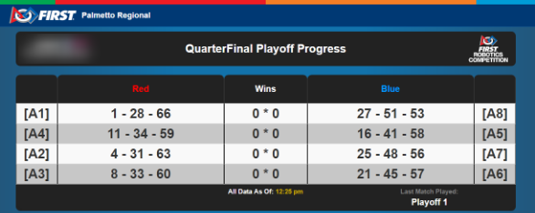

.. _pit-display-playoffs:

Playoffs Pit Display
======================

Playoff Pit Display

The Qualification and Playoff Pit Display look very similar, except that the detail of team-by-team ranking in Qualifications is replaced with a row-per-match type display.

Across the bottom of the display are indicators of the last match played on the field, and the last time the data was updated. Note: The "all data as of" marker is based on 
the Pit machine's time, not the event server. Please make sure the Timezone is properly set on the Pit machine for timing to be accurate.

In each row, the [AX] number indicates the Alliance number, followed by the dash separated team numbers on the Alliance. The opposite exists on the blue alliance side of the 
display. In the middle is the number of wins each alliance has, red on the left and blue on the right.
