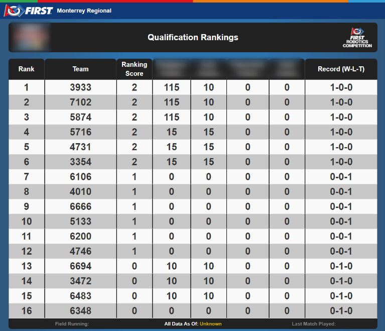

Qualifications Pit Display
==========================

Qualification Pit Display

Display
-------

The standard Qualification Pit Display looks similar to the internet event results pages, but specially adapted for use on site at events in progress.

Across the bottom of the display are indicators of the last match played on the field, the time difference between that Published schedule and the actual times that match was played, and the last time the data was updated. Note: The "all data as of" marker is based on the Pit machine's time, not the event server. Please make sure the Timezone is properly set on the Pit machine for timing to be accurate.

The remainder of the screen is dedicated to current rankings as of Last Match Played on the field, as indicated at the bottom of the screen.

Along with rank and team number detailed information related to that season's game is displayed, based on the tie-breaking criteria shown in the game manual.

The Pit Display web page auto scrolls through the ranking list.

The Display will automatically advance to Playoffs once the schedule is activated.

