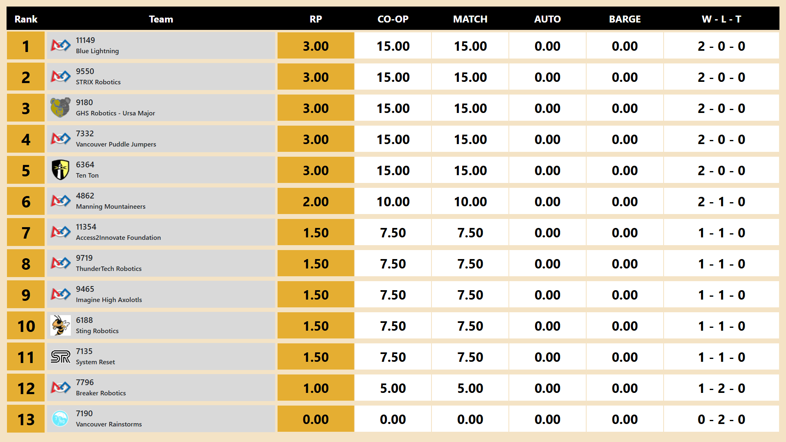

.. _pit-display-quals:

Qualifications Pit Display
============================================

Qualification Pit Display

The standard Qualification Pit Display looks similar to the Qualification Rankings screen on the Audience Display.

The Pit Display will fill the available vertical space on screen with rankings and then transition between "pages" of rankings.

.. note::
    If there are no rankings yet, only the header will appear on this screen.

Along with rank and team number detailed information related to that season's game is displayed, based on the tie-breaking criteria shown in the game manual.

The Pit Display web page auto scrolls through the ranking list.

The Display will automatically advance to Playoffs once the schedule is activated.
