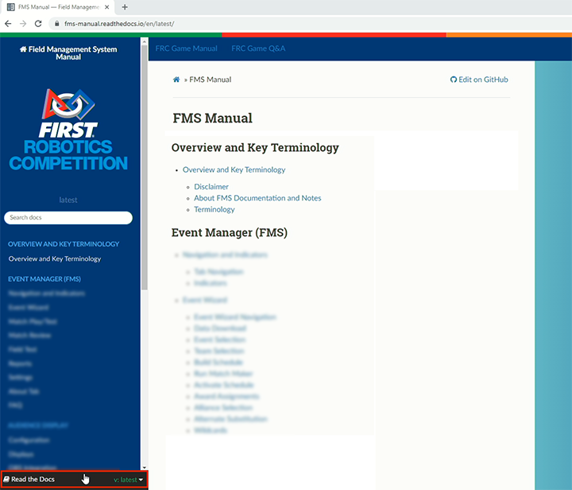

.. include:: <isonum.txt>
.. _scorekeeper-overview:

Overview
======================

This Scorekeeper step-by-step, and this User Manual on the whole, are meant to prepare Scorekeepers to be successful in their role at FRC events. Outside of this documentation Scorekeepers at 
official FRC events are invited to join the Scorekeeper Slack workspace for additional learning opportunities and discussion space.

THANK YOU very much from all of us at *FIRST* for volunteering your time and talent to making our events happen!

Purpose
-------

The purpose of this "Scorekeepers Reference" section (including the step-by-step) is to give FRC Scorekeeping volunteers a handy reference guide and materials 
to supplement the more detailed information that can be found in the full User's Manual.

Usage
------

This guide may be of help to Off-Season events, but is designed for official in-season events.

In the Step-by-Step section, "Days" designated to specific steps are assuming a traditional regional schedule and may not apply to a condensed (district) schedule.

Prior to an event, Scorekeepers may find it helpful to export this documentation to be printed or saved on a personal device. To export, click on the 'Read the Docs' label in the bottom-left corner of the page to open the panel.

In the panel you can select either a PDF or HTML version to download.

.. image:: images/scorekeeper-intro-1.png

.. note::
    Due to the dynamic nature of this documentation, for those that choose to download, it is recommended to check for updated documentation prior to each event.

FMS Overview
------------

The Field Management System (FMS) is the electronics core of a *FIRST* Robotics Competition (FRC) playing field and encompasses both hardware and software components. 
The software package is used to control all the field electronics (LED Displays, Station Control Cabinets, E-stops, enable/disable of the Robots, network security, etc.) 
and is used to manage the event by creating match schedules, scoring the matches in real-time, and posting information to the Audience screen. The Scorekeeper, with 
direction and guidance from the FTA, manages the FMS during an FRC event.
