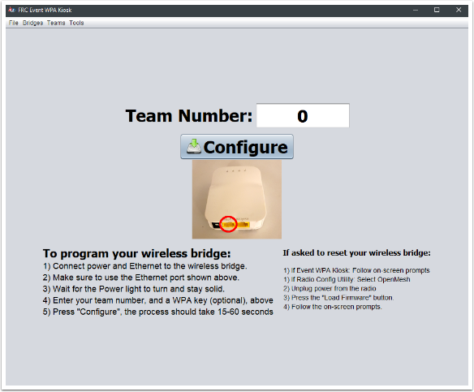

WPA Kiosk Operation
===================

This article assumes the kiosk has been configured by event staff and is ready for team use. If not, please see the configuration article.

Enter Team and Program
----------------------

A full-screen programming interface is available for programming team radios. Attach the radio to power and the Kiosk machine's Ethernet as shown in the steps on the Kiosk, enter the team number into the box, and select "Configure."

