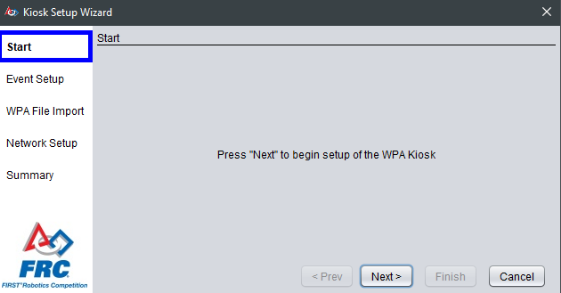
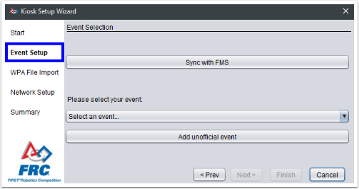
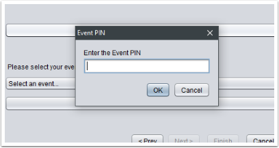
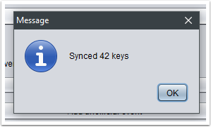
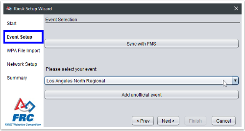
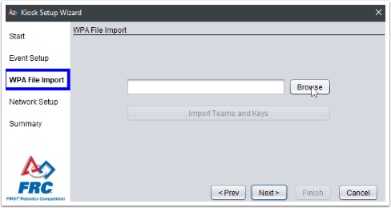
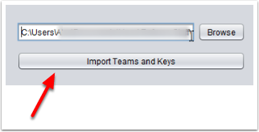
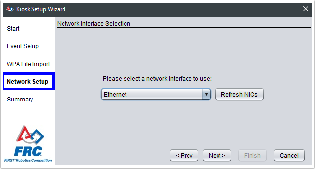
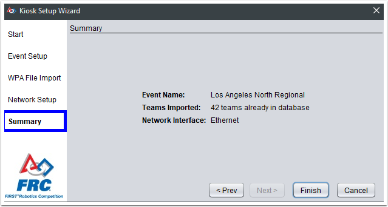

WPA Kiosk
=========

Navigation and use of the WPA Event Kiosk Pogram

Opening View
------------

.. image:: images/wpa-kiosk-0.png

The WPA Kiosk has a very basic interface. All navigation is done using the buttons on the bottom right of the program. The setup wizard is available by default when launching the program.

Select Event / Keys using Sync with FMS
---------------------------------------

.. image:: images/wpa-kiosk-2.png

The preferred way to load an event and keys into the Kiosk is via "Sync with FMS." Attach the machine running the program to the playing field to use this option. Select the "Sync with FMS" button.

The kiosk will prompt for the PIN number of the event currently active in FMS. This is available from the FTA. Enter the PIN and select OK.

If correct, the number of keys retrieved will be displayed. When using Sync with FMS, simply skip the "WPA File Import" step (after successful download) using the "Next" button on the bottom of the screen.

Select Event / Keys Manually
----------------------------

As an alternative, instead of Sync from FMS, the event can be manually selected using the provided dropdown menu, or by selecting "Add unofficial event" and enter the event information. There is no effect on the operation of the kiosk software for using Sync with FMS, selecting an event from the dropdown, or adding one manually. All result in the same team-facing experience.

.. image:: images/wpa-kiosk-9.png

If the event was selected or entered manually, keys must be provided using a Key file from FMS. This file can be uploaded on the "WPA File Import" page.

.. image:: images/wpa-kiosk-10.png

Select the key file generated by FMS from a USB drive used to transfer the file, but do not copy the file onto the machine. The contents will be loaded into memory, but storing the key file itself on the computer leaves the keys vulnerable.

.. image:: images/wpa-kiosk-13.png

After selecting the file, click "Import Teams and Keys" to move the data into the kiosk program. Without clicking this button, no data will be loaded into the kiosk.

Network Setup
-------------

.. image:: images/wpa-kiosk-14.png

After selecting or loading the event and adding the keys, select the network interface to use for programming radios. In most cases, there will be a single Ethernet interface, which will work fine. Select "Next" to complete configuration.

Summary
-------

The selected settings will be confirmed on the summary page. Select Finish to begin to program team radios. If the Kiosk was attached to the playing field to use Sync with FMS, it should be removed and placed in a location accessible for those needing to use it.

.. image:: images/wpa-kiosk-16.png

